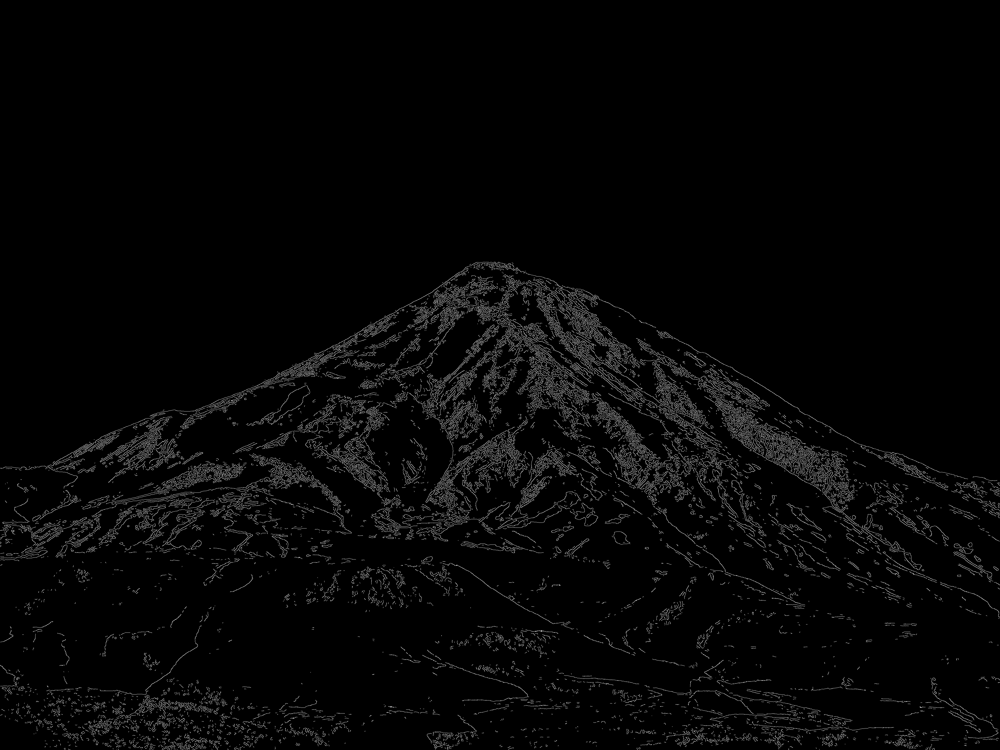

# 🖋️ Inkifier

Turn your photos into striking ink-style artworks with **Inkifier**, powered by Rust's OpenCV and Canny Edge Detection! ✨

## 🎨 Before & After

### 📷 Input:

### 🖤 Output:

## 🚀 Installation & Usage

1. Copy the files inside `src/inkifier-website` to your PHP web server's root directory.
2. That’s it! 🎉

## 🛠️ How It Works
Inkifier harnesses **Rust** and **OpenCV** to apply Canny Edge Detection, converting your images into high-contrast, ink-style renderings with ease.

## 📌 Features
✔️ **Rust-powered** for blazing-fast performance ⚡️  
✔️ **Uses OpenCV** for high-quality edge detection 🎭  
✔️ **Simple setup** – Just drop and run! 🚀  

## 🌟 Support & Contribution
Got ideas to improve **Inkifier**? Pull requests and feedback are always welcome! 😊  
Give this repo a ⭐ if you like it!

